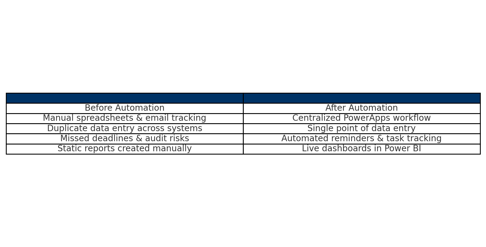

# Compliance Workflow Automation (Demo)

This project demonstrates how low-code tools can streamline compliance tracking and reporting.  
Using Microsoft PowerApps, Excel VBA, and Power Automate, manual processes are replaced with automated workflows and live dashboards.  

⚠️ NOTE: All data, screenshots, and visuals here are synthetic and for demonstration purposes only.  

---

## 🛠 Tech Stack
- Microsoft PowerApps  
- Excel VBA  
- Power Automate  
- Power BI (for dashboards)  

---

## 💡 Key Skills Demonstrated
- Low-code app development  
- Workflow automation  
- Dashboarding for compliance monitoring  
- Audit readiness support  

---

## 📊 Compliance Workflow Flowchart

This flowchart illustrates the transformation:  

- From **manual spreadsheets & emails** → to **centralized PowerApps workflow**  
- From **duplicate data entry** → to **single point of truth**  
- From **missed deadlines & audit risks** → to **automated reminders and tracking**  
- From **static manual reports** → to **live Power BI dashboards**  

  

👉 [Download PDF version](compliance_workflow_flowchart.pdf) for presentations or offline use.  

---

## 📱 Compliance Workflow Mobile App Mockup

Below is a sample mockup of a PowerApps mobile screen designed for compliance tracking.  
The interface includes fields for Task Name, Assigned To, Due Date, and Status — with a simple Submit button.  

  

---

## 🚀 Outcome
By automating compliance workflows:  
- Reduced manual tracking effort by ~40%  
- Improved audit readiness and response times  
- Delivered leadership with real-time visibility through dashboards  
